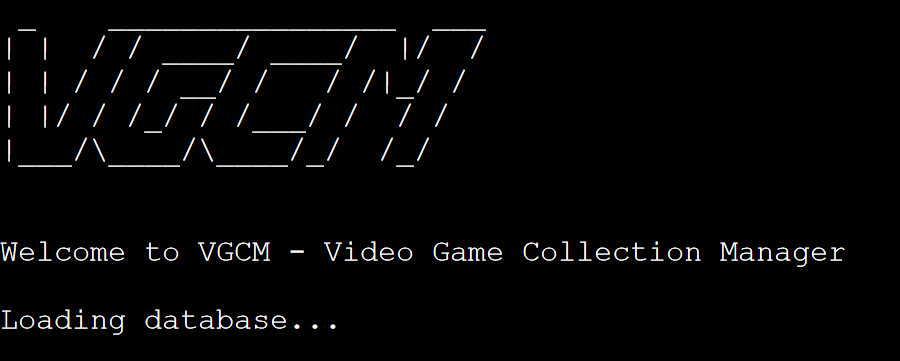
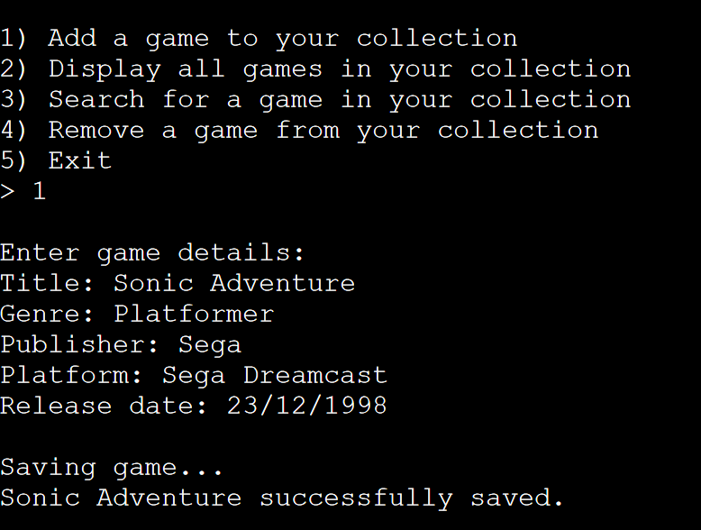

# VGCM - Video Game Collection Manager

# Project Overview

The aim of this project is to provide a simple application for a video game collector to manage their collection.  

Maintaining a collection of any kind can be a fun and fulfilling hobby, but sometimes keeping track of everything you own can be a little overwhelming. The Video Game Collection Manager (VGCM) aims to ease this burden by keeping track of the games in your collection, letting you expand your collection without worry.

# Table of Contents

- [Planning Stage](planning-stage)
    - [Target Audience](target-audience)
    - [User Stories](user-stories)
    - [Categories](categories)
- [Development Stage](development-stage)
    - [Code Architecture](code-architecture)
- [Features](features)
    - [Welcome Message](welcome-message)
    - [Menu](menu)
    - [Create Game](create-game)
    - [Display All Games](display-all-games)
    - [Search For Games](search-for-games)
    - [Delete Games](delete-games)
    - [Input Validation](input-validation)
- [Persistent Memory](persistent-memory)
    - [API Error Handling](api-error-handling)
- [Testing](testing)
    - [Bugs](bugs)
    - [Manual Testing](manual-testing)
    - [Linter](linter)
- [Deployment](deployment)
- [Credits](credits)

# Planning Stage

## Target Audience

The target audience for this project is anyone who has or is interested in starting a collection of video games. The market for retro and contemporary gaming is ever expanding, especially as younger gamers are introduced to legendary franchises like Sonic the Hedgehog and Super Mario.  

Anyone who has maintained a collection knows the struggle of keeping a huge spreadsheet up to date as their collection expands - this project is aimed towards those people, and proposes a simple solution to manage their hobby.

## User Stories

- As a user, I want to add games to my collection
- As a user, I want to remove games from my collection
- As a user, I want to view my collection
- As a user, I want to search and sort my collection
- As a user, I want to save and load my collection

## Categories

In order to sort the collection, each game must have a number of categories that it can be searched by.  

These will include:
- Title (eg. Fallout: New Vegas)
- Genre (eg. RPG)
- Publisher (eg. Bethesda Softworks)
- Developer (eg. Obsidian Entertainment)
- Platform (eg. Xbox 360)
- Release Date (eg. 22/10/2010)
- Purchase Date (eg. 03/06/2022)

During development, the developer and purchase date attributes had to be scrapped due to the 80 character width of the virtual terminal the project would be hosted on. This was to ensure all data is correctly presented to the user.

# Development Stage

## Code Architecture

The code for this project is designed to be as reusable as possible. It is separated into four distinct python files (run.py, game.py, database.py and sheetconnection.py).

run.py contains all the code used to execute the application in a command line interface.

game.py contains the logic used to digitally represent games in memory, using a class.

database.py contains the code to manage in-memory data storage.

Finally, sheetconnection.py contains the code used to connect to Google Sheets.

The codebase was designed in this way so that parts of the system could be slotted in and out with relative ease - if a GUI were to be developed, it could continue to use the game, database and sheetconnection files. Similarly, if it was decided to use a database such as PostgreSQL to persistently store data, the sheetconnection class could be replaced.

# Features

VGCM offers a way to manage and store information on a collection of video games through a command line interface.

## Welcome Message

Upon loading the application, the user is presented with an ASCII art style logo, and a welcome message. This is primarily intended to subconsciously let the user know that the program has loaded correctly, while also displaying the name and purpose of the software. There is also a pause in execution while the Google Sheet is loaded, so I included a status message saying "loading database" to reassure the user that the program has not crashed.

## Menu

After the welcome message has been displayed, a menu is output to the user with a list of functions. The user must enter the number corresponding to the option they want to choose.

If an invalid input is entered, the program displays an error message and the menu is displayed again.

 

 ## Create Game

 The first option is to create a new game and add it to the database. The program prompts the user to enter valid inputs for each attribute, then displays confirmation that the game is saved.

 

 ## Display All Games

 The second option in the menu is to display all games. On selecting this, another menu is displayed asking the user what attribute to sort the list by - they can choose any of the attributes on the games (title, genre, publisher, platform, release date), or leave blank to leave the list in its default order. This menu has similar input validation to the main menu.

 The list of games is then displayed in a table format, and the user is again prompted to enter a main menu choice.

 

 

 ## Search For Games

 The third option is to search for a game. The user is prompted to enter game details, and they can leave each attribute blank to include all results. The search terms (aside from release date) work on whether the game's attribute contains that term - for example, searching `Title: Sonic` and `Platform: Sega Genesis` might return Sonic the Hedghog, but not Sonic CD for the Sega CD.

 Once again, the user can decide which attribute the list should be sorted by.

## Delete Games

The final option is to delete games. This works similarly to find games, in that the user is prompted to enter game details and the result is displayed in a table. The program then asks for confirmation to delete the games, which are removed from memory and the Google Sheet is overwritten.

## Input Validation

Whenever the user is prompted to enter data, the program runs validation to check that the input is acceptable. In most cases, this means checking if a string input is empty, or if a menu choice is within the accepted options. Validation also runs when the user has to enter a date, making sure it's in the format DD/MM/YYYY.

# Persistent Memory

I knew from the start that I wanted some way to save data between uses of the program. I went through a few ideas before settling on one solution:
- First, I intended to connect to a PostgreSQL database. This idea was rejected soon into development as I realised it was a little too complicated for my skill level.
- I then thought about saving and reading to/from a CSV file.
    - While this was a simple solution, I didn't understand how to download the file onto the user's computer.
    - Forcing the user to enter a full file path without any mistakes in order to load a file also had the potential to be unnecessarily difficult and frustrating for the user.
- Finally, I decided to connect to a Google Sheet.
    - This worked well enough and was fairly simple to implement.
    - The main issue with this approach is that there can't be separate sessions - every user has access to the same dataset. I decided that this was a minor enough issue for a project of this scope that it was acceptable to use Google Sheets regardless.

## API Error Handling

When connecting to an API, such as Google Sheets, there is the possibility for errors to be thrown regardless of how well the code is written - for example, the API service may be temporarily down.  

In run.py, any operations that make API requests are wrapped in a `try` block. If the program catches a `GSpreadException`, feedback is given to the user saying that the operation failed.

When the database is originally loaded a the start of the program, if an API error occurs, the program calls `sys.exit(1)`, raising a `SystemExit` exception and exiting the program with a status code of 1, declaring that an error has occurred. This is because without an initial connection to the database, no other operations can be executed and the program will essentially be non-functional.

# Testing

## Bugs

- When implementing input validation for creating a new game, an error would be thrown when one of the initially entered values was invalid, even if the final inputs were valid.
    - This was because the list the values were being appended to had been declared outside the while loop, meaning the previous values were still in the list.
    - That list was then being passed to the database to create a new game, which included more values than expected, causing the error.
- When deleting games, none would be deleted even though the correct games were found.
    - This was because the `delete_game` function called `find_game`, which used a deep copy of the database's records.
        - This meant that the object references were not the same as the originals, meaning comparing an object's id from the `find_game` function and the "same" object from the original records would return false.
        - Subsequently, the `delete_game` function didn't find any objects in the original records that matched the ones it was asked to delete.
    - Changing find_game to create a shallow copy fixed this issue.
- When the `prompt_date_input` function was called passing `allow_empty=True`, an invalid date would be accepted as a valid input.
    - This was due to the try block catching the exception when parsing the string, but there was only a single condition checking whether `allow_empty` was true to determine if the input should actually be accepted.
    - I changed the condition to `if not user_input and allow_empty`, which only evaluates to true if the input string is empty.
- When searching for games with multiple filters, some games would be returned more than once.
    - This was because for each parameter I was adding each game that matched to a list. If a game matched more than one parameter, it would be added each time.
    - To fix this, I copied the original list into a new list, then for each parameter removed games that didn't match.
        - This introduced a new issue, where some games would be in the list but not evaluated and as such would be in the final list despite not matching the filters.
        - While I'm not certain on the technicalities of this issue, I thought that removing items from a list while iterating over that same list may cause issues. I then decided to iterate over the original list, which would not be changed, and remove any matches from the new list. This fixed the issue.

## Manual Testing

At every stage during development, the code was manually tested through the in-built terminal in VSCode and through the virtual terminal that the project would eventually be run on (in order to run this without deploying the project, first enter the command `node i` then `node index.js`).

After implementation of each feature and fix, it was tested thoroughly to ensure it was bug free.

## Linter

During development, the PEP8 linter included with the Python package in VSCode was used to ensure that all code conformed to Python style guides.

# Deployment

In order to run backend Python code, the app has been deployed to [Heroku](https://www.heroku.com). There are a number of steps to do this:

- From your workspace, run the command `pip freeze > requirements.txt`
- Create a Heroku account and create a new app.
- Under the settings tab, add the config vars:
    - `PORT: 8000`
    - `CREDS:`
        - Here, copy in the contents of creds.json that allow you to connect to Google Sheets.
- Under buildpacks in the settings tab, add Python and Node.js.
- Under the deploy tab, connect to your GitHub account and select the repository to connect to.
- Under manual deploy, select branch main and click deploy.

The deployed project can be found at [https://vgcm.herokuapp.com/](https://vgcm.herokuapp.com/)

# Credits

- Code to connect to Google Sheets adapted from Code Institute's walkthrough project, Love Sandwiches.
- MDN, Stack Overflow, and W3Schools were used as general reference throughout the development of the project.